<p align="center">
  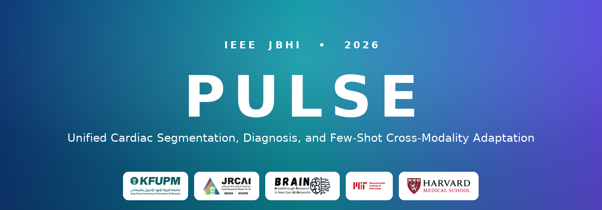
</p>

<p align="center">
  <b><a href="https://scholar.google.com/citations?user=iVWuM4wAAAAJ&amp;hl=en">Hania Ghouse</a></b><sup>1</sup> &nbsp;
  <b><a href="https://scholar.google.com/citations?user=ai_buWkAAAAJ&amp;hl=en">Maryam Alsharqi</a></b><sup>2</sup> &nbsp;
  <b><a href="https://scholar.google.com/citations?user=n-1I8IIAAAAJ&amp;hl=en">Farhad Nezami</a></b><sup>2,3</sup> &nbsp;
  <b><a href="https://muzammilbehzad.com/">Muzammil Behzad</a></b><sup>1,4</sup>
</p>

<p align="center">
  <sup>1</sup>KFUPM &nbsp; <sup>2</sup>Institute for Medical Engineering and Science, MIT &nbsp; <sup>3</sup>Harvard Medical School &nbsp; <sup>4</sup>KFUPM-SDAIA Joint Research Centre for AI
</p>

<p align="center">
  <a href="#citation">Paper</a> &nbsp;|&nbsp;
  <a href="https://brain-lab-ai.github.io/PULSE/">Project Page</a> &nbsp;|&nbsp;
  <a href="checkpoints/README.md">Pretrained Weights</a> &nbsp;|&nbsp;
  <a href="#get-started">Get Started</a> &nbsp;|&nbsp;
  <a href="#qualitative-results">Results</a>
</p>

<p align="center">
  <a href="https://github.com/BRAIN-Lab-AI/PULSE"></a>
  <a href="https://brain-lab-ai.github.io/PULSE/"></a>
  <a href="https://github.com/BRAIN-Lab-AI/PULSE/releases/tag/v1.0"></a>
  <a href="#citation"></a>
  
  
  
  <a href="https://sa.linkedin.com/in/hania-ghouse"></a>
</p>

<p align="center">
  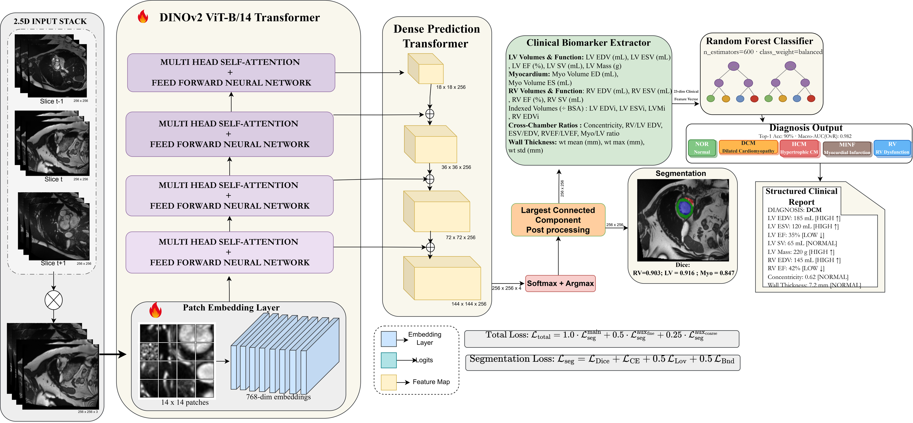
</p>
<p align="center"><sub>PULSE reads one short-axis cardiac MRI study and returns segmentation, cardiomyopathy diagnosis, and a structured clinical report in a single pass.</sub></p>

---

## News

- **2026-08-14:** PULSE is accepted to the IEEE Journal of Biomedical and Health Informatics (JBHI).
- **2026-08:** Code released.
- **2026-08:** Pretrained 5-fold checkpoints released ([v1.0](https://github.com/BRAIN-Lab-AI/PULSE/releases/tag/v1.0)).
- **2026-08:** Project page is online.

---

## Abstract

Cardiac image analysis requires accurate ventricular segmentation, disease classification, and structured clinical reporting; these tasks are typically handled by separate models, limiting clinical deployment. To address this, we introduce PULSE, a unified three-task framework that performs: (1) ventricular segmentation using a DINOv2 Vision Transformer (ViT-B/14) backbone with a Dense Prediction Transformer (DPT) decoder and deep supervision; (2) cardiomyopathy diagnosis via a 23-dimensional clinical biomarker vector fed to a Random Forest classifier; and (3) a structured, template-based clinical reporting module that populates a predefined report with the measured indices and rule-based abnormality flags. The framework is entirely vision-based: all reported text is produced by deterministic, rule-driven templates. Additionally, the model takes 2.5D inputs (three adjacent short-axis slices) and is evaluated via a 5-fold stratified ensemble. With extensive experiments on the ACDC benchmark, PULSE achieves a mean Dice of 88.8% (RV: 90.3%, Myo: 84.7%, LV: 91.6%, HD95 &le; 4.6 mm), 90.0% patient-level diagnostic accuracy (macro-AUC 0.982), and 92.7% clinical flag agreement in the generated reports (LVEF MAE 3.09%, within inter-observer tolerance). Without retraining, PULSE achieves 85.3% mean Dice on M&Ms-2 (360 subjects, RV: 87.9%, Myo: 80.4%, LV: 87.5%) and 88.1% LV Dice on Sunnybrook MRI. We further demonstrate that few-shot fine-tuning on CAMUS echocardiography samples yields a mean Dice of 73.2%, showing strong cross-modality transfer from cardiac MRI priors.

## Key Contributions

- A unified framework that delivers segmentation, cardiomyopathy diagnosis, and structured reporting from a single cardiac MRI study.
- A foundation-model segmentation backbone (DINOv2 ViT-B/14) with a DPT decoder, a two-stage fine-tuning curriculum, and deep supervision.
- An interpretable, biomarker-driven diagnosis stage that is decoupled from the image encoder.
- Strong zero-shot generalization across scanner vendors and few-shot cross-modality transfer to echocardiography.

## Table of Contents

[Installation](#installation) &nbsp;|&nbsp; [Pretrained Models](#pretrained-models) &nbsp;|&nbsp; [Get Started](#get-started) &nbsp;|&nbsp; [Training](#training) &nbsp;|&nbsp; [Evaluation](#evaluation) &nbsp;|&nbsp; [Datasets](#datasets) &nbsp;|&nbsp; [Results](#results) &nbsp;|&nbsp; [Qualitative Results](#qualitative-results) &nbsp;|&nbsp; [Repository Structure](#repository-structure) &nbsp;|&nbsp; [Citation](#citation)

---

## Installation

PULSE runs on Linux, macOS, and Windows. A GPU is recommended for training; inference also runs on CPU.

**1. Create and activate an environment.**
```bash
conda create -n pulse python=3.10 -y
conda activate pulse
```

**2. Install PyTorch for your machine.** Pick the correct build from the [official selector](https://pytorch.org/get-started/locally/). For example, CUDA 12.1:
```bash
pip install torch torchvision --index-url https://download.pytorch.org/whl/cu121
```
On a CPU-only machine or Apple Silicon, `pip install torch torchvision` is correct.

**3. Clone the repository and install the remaining dependencies.**
```bash
git clone https://github.com/BRAIN-Lab-AI/PULSE.git
cd PULSE
pip install -r requirements.txt
```

The DINOv2 ViT-B/14 backbone downloads automatically from the Hugging Face Hub on first use. A per-platform guide is in [docs/INSTALL.md](docs/INSTALL.md).

## Pretrained Models

The released model is a 5-fold ensemble. Download the checkpoints with the helper script (details in [checkpoints/README.md](checkpoints/README.md)):

```bash
bash checkpoints/download_weights.sh
```

| Model | Backbone | Training data | Files | Size |
|:---|:---|:---|:---|:---|
| PULSE (5-fold) | DINOv2 ViT-B/14 | ACDC | `folds_vdino/fold_{0..4}/best_model.pth` | ~1.8 GB |

---

## Get Started

This section uses the **released pretrained model**. To train your own from scratch, see [Training](#training).

### 1. Download the weights
```bash
bash checkpoints/download_weights.sh
# result: checkpoints/folds_vdino/fold_{0..4}/best_model.pth
```

### 2. Segment a single scan
No dataset is needed. Runs on CPU or GPU.
```bash
python pulse/infer.py \
    --input path/to/scan.nii.gz \
    --folds_dir checkpoints/folds_vdino \
    --output prediction.nii.gz
```
The output is a label map with the same shape as the input, where `0 = background, 1 = RV, 2 = Myocardium, 3 = LV`. Use `--device cpu` to force CPU, or `--weights checkpoints/folds_vdino/fold_0/best_model.pth` for a single fold.

### 3. Run the full pipeline on ACDC (segmentation, diagnosis, report)
```bash
# a) Segmentation metrics + per-patient biomarkers
python pulse/ensemble_eval.py --folds_dir checkpoints/folds_vdino --out features.json --data_root $ACDC_ROOT
# b) Cardiomyopathy diagnosis (Random Forest, 10-seed ensemble)
python pulse/diagnosis_classify.py --features features.json --seeds 10
# c) Structured clinical report per patient
python pulse/generate_report.py --features features.json --out_dir reports/
```

### 4. Use PULSE in Python
```python
import torch, pulse_seg as ps
model = ps.PULSESeg()
ckpt = torch.load("checkpoints/folds_vdino/fold_0/best_model.pth", map_location="cpu")
model.load_state_dict(ckpt["model"]); model.eval()
```

---

## Training

This section trains PULSE **from scratch** on ACDC. To use the released model, see [Get Started](#get-started).

### 1. Prepare the dataset
Download ACDC (see [Datasets](#datasets)) and arrange it as `ACDC/database/{training,testing}/patientXXX/...`, then:
```bash
export ACDC_ROOT=/path/to/ACDC/database
```

### 2. Train a single fold
About 20 minutes on an NVIDIA A100 40 GB.
```bash
python pulse/train.py --fold 0 --nfolds 5 --epochs 120 --bs 16 \
    --ckpt_dir checkpoints/folds_vdino/fold_0 --data_root $ACDC_ROOT
```

### 3. Train all five folds
```bash
for f in 0 1 2 3 4; do
  python pulse/train.py --fold $f --nfolds 5 --epochs 120 --bs 16 \
      --ckpt_dir checkpoints/folds_vdino/fold_$f --data_root $ACDC_ROOT
done
```

### 4. Outputs and configuration
Each fold writes `best_model.pth` and `history.json` to its `--ckpt_dir`. The default configuration reproduces the paper (defined in `pulse/pulse_seg.py`, documented in `configs/default.yaml`). Batch size is the main memory control: 16 on A100/H100, 8 on RTX 3090/4090, 4 on 8 to 12 GB GPUs. See [docs/TRAINING.md](docs/TRAINING.md).

---

## Evaluation

```bash
python pulse/eval_mnm.py           --folds_dir checkpoints/folds_vdino   # M&Ms-2, zero-shot
python pulse/eval_sunnybrook.py    --folds_dir checkpoints/folds_vdino   # Sunnybrook, zero-shot LV
python pulse/eval_camus_fewshot.py --folds_dir checkpoints/folds_vdino   # CAMUS, few-shot
```
Additional utilities: `eval_perdisease.py`, `eval_ensemble_scaling.py`, and `bootstrap_ci.py`. See [docs/INFERENCE.md](docs/INFERENCE.md).

## Datasets

All four datasets are public and require a free registration. PULSE is trained only on ACDC; the others are held-out evaluation. Folder layouts are in [docs/DATASETS.md](docs/DATASETS.md).

| Dataset | Modality | Role | Access |
|:---|:---|:---|:---|
| ACDC | Cine MRI | Training and testing | https://acdc.creatis.insa-lyon.fr |
| M&Ms-2 | Multi-vendor cine MRI | Zero-shot evaluation | https://www.ub.edu/mnms-2/ |
| Sunnybrook | Cine MRI | Zero-shot LV evaluation | https://www.cardiacatlas.org/sunnybrook-cardiac-data/ |
| CAMUS | Echocardiography | Few-shot adaptation | https://www.creatis.insa-lyon.fr/Challenge/camus/ |

## Results

| Structure | Dice (%) | IoU (%) | HD95 (mm) | ASSD (mm) |
|:---|:---:|:---:|:---:|:---:|
| Left ventricle (LV) | 91.6 | 84.5 | 3.87 | 0.95 |
| Myocardium (Myo) | 84.7 | 73.5 | 3.72 | 0.87 |
| Right ventricle (RV) | 90.3 | 82.3 | 4.57 | 1.05 |
| **Mean** | **88.8** | **80.1** | **4.05** | **0.96** |

| Method | RV | Myo | LV | Mean | Diagnosis |
|:---|:---:|:---:|:---:|:---:|:---:|
| U-Net | 82.3 | 78.7 | 94.9 | 85.3 | No |
| nnU-Net | 90.1 | 88.4 | 95.7 | 91.4 | No |
| TransUNet | 84.5 | 77.7 | 94.1 | 85.4 | No |
| SwinUNet | 90.7 | 79.1 | 93.9 | 87.9 | No |
| **PULSE (ours)** | 90.3 | 84.7 | 91.6 | 88.8 | **90.0%** |

Diagnosis: 90.0% accuracy, macro-F1 0.900, macro-AUC 0.982. Zero-shot: M&Ms-2 (360) 85.3% Dice, Sunnybrook 88.1% LV Dice. Few-shot CAMUS: 68.7% (N=5), 70.6% (N=10), 73.2% (N=20).

---

## Qualitative Results

### Segmentation on ACDC
End-diastole and end-systole predictions across cardiomyopathy classes. LV (red), Myocardium (green), RV (blue).
<p align="center">
  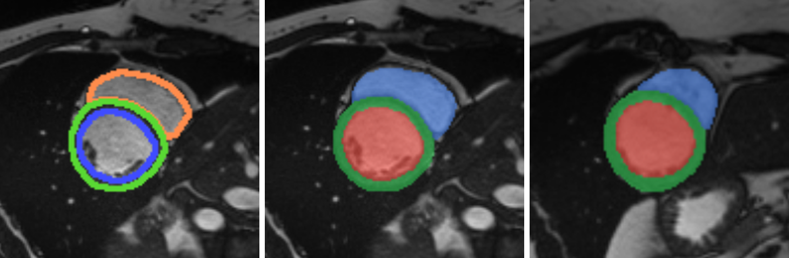<br>
  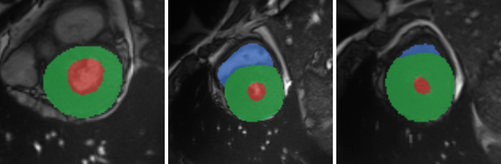
</p>

### Diagnosis and per-disease analysis
<p align="center">
  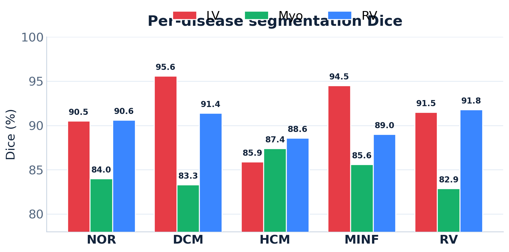
  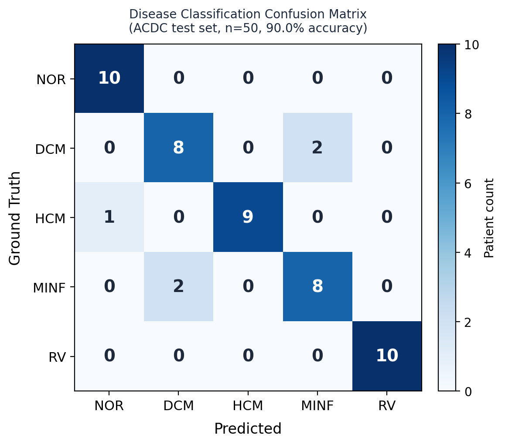<br>
  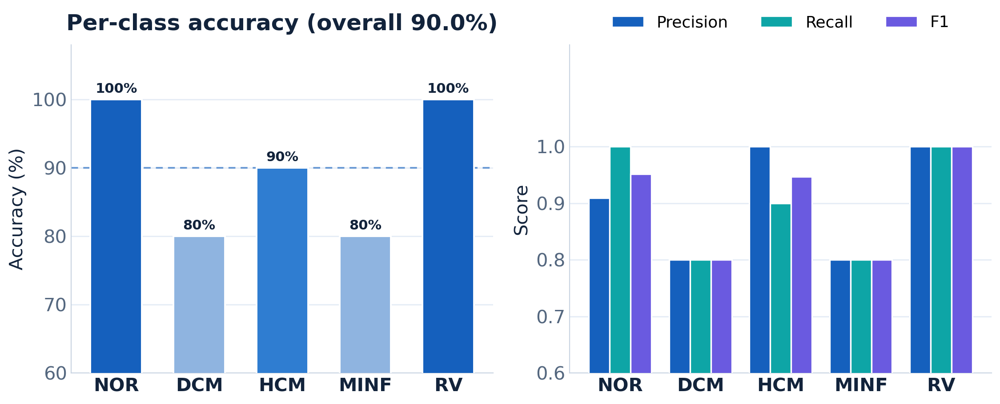
</p>

### Zero-shot generalization to multi-vendor MRI (M&Ms-2)
<p align="center">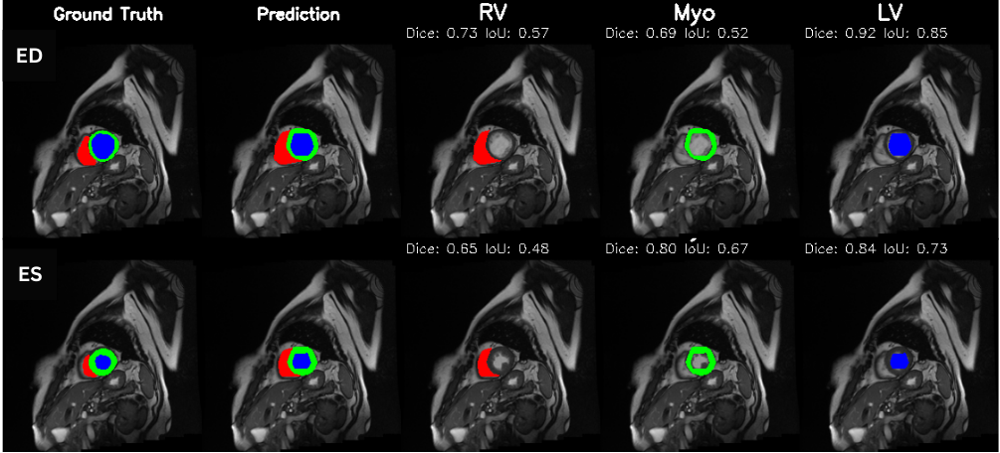</p>

### Zero-shot transfer to Sunnybrook
<p align="center">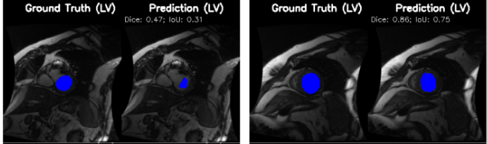</p>

### Few-shot cross-modality adaptation to echocardiography (CAMUS)
<p align="center">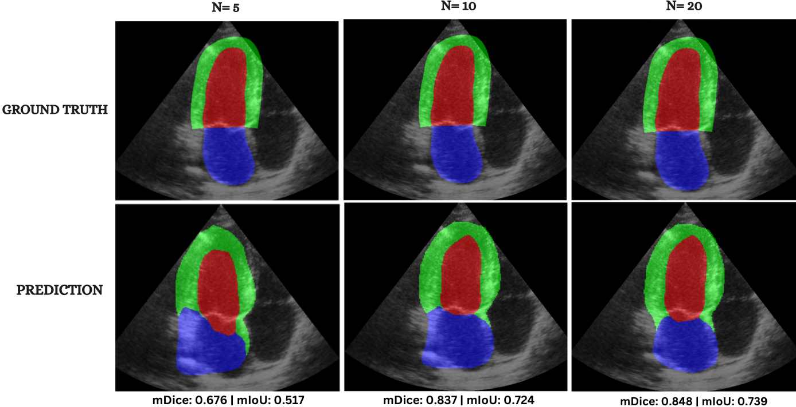</p>

### Model interpretability (DINOv2 attention)
<p align="center">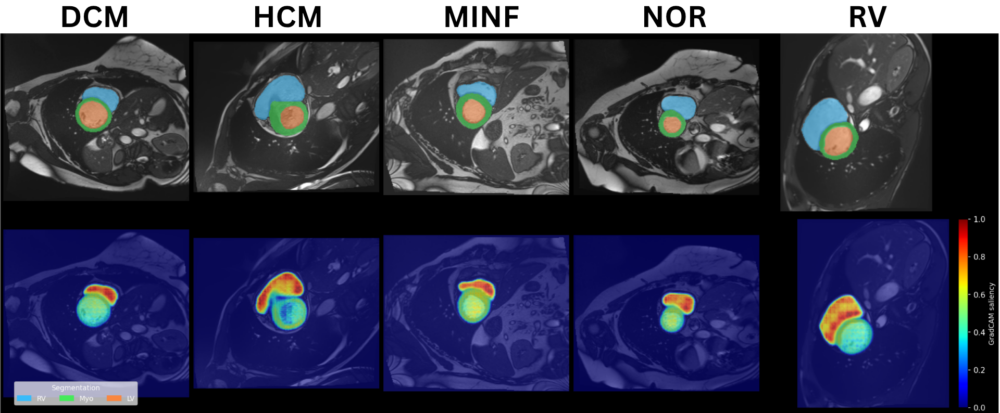</p>
<p align="center"><sub>Self-attention concentrates on the cardiac region across all disease classes, without any attention supervision.</sub></p>

---

## Repository Structure

```
PULSE/
├── pulse/                  Python source (model, training, inference, evaluation, ablations)
├── configs/default.yaml    training configuration used in the paper
├── checkpoints/            download pretrained weights here
├── docs/                   INSTALL, DATASETS, TRAINING, INFERENCE guides
├── assets/                 figures and institution logos
├── scripts/slurm/          optional cluster submission scripts
├── requirements.txt / environment.yml
└── index.html              project website
```

Inside `pulse/`:

- **Model and training.** `pulse_seg.py` (model `PULSESeg`, losses, ACDC loader, 2.5D input, two-stage training loop), `train.py` (training entry point), `infer.py` (single-volume inference), `postprocess.py`.
- **Diagnosis and reporting.** `diagnosis_features.py` (23 biomarkers), `diagnosis_classify.py` (Random Forest), `generate_report.py` (structured report).
- **Evaluation.** `ensemble_eval.py`, `eval_mnm.py`, `eval_sunnybrook.py`, `eval_camus_fewshot.py`, `eval_perdisease.py`, `eval_ensemble_scaling.py`, `bootstrap_ci.py`.
- **Ablations.** One script per paper ablation, prefixed `vdino_abl_*`.
- **Figures.** `gen_*.py` and `regen_*.py` reproduce the paper figures.

## Citation

```bibtex
@article{ghouse2026pulse,
  title   = {PULSE: A Unified Multi-Task Architecture for Cardiac Segmentation,
             Diagnosis, and Few-Shot Cross-Modality Clinical Adaptation},
  author  = {Ghouse, Hania and Alsharqi, Maryam and Nezami, Farhad and Behzad, Muzammil},
  journal = {IEEE Journal of Biomedical and Health Informatics (JBHI)},
  year    = {2026}
}
```

## License

Released under the [MIT License](LICENSE).

## Acknowledgements

We thank the organizers of the ACDC, M&Ms-2, Sunnybrook, and CAMUS challenges for the public datasets, and Meta AI for the open-source DINOv2 backbone. This work was carried out at the BRAIN Lab, KFUPM, with the KFUPM-SDAIA Joint Research Centre for AI.

## Contact

For questions, please open a [GitHub issue](https://github.com/BRAIN-Lab-AI/PULSE/issues) or reach out to:

- **Hania Ghouse**: haniaghouse704@gmail.com ([Google Scholar](https://scholar.google.com/citations?user=iVWuM4wAAAAJ&hl=en), [LinkedIn](https://sa.linkedin.com/in/hania-ghouse))
- **Muzammil Behzad**: muzammil.behzad@kfupm.edu.sa ([Website](https://muzammilbehzad.com/))
