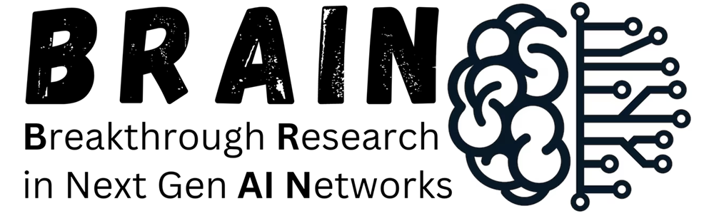

<p align="center">
   &nbsp;&nbsp;
   &nbsp;&nbsp;
   &nbsp;&nbsp;
   &nbsp;&nbsp;
  
</p>

<h1 align="center">PULSE</h1>

<p align="center">
  <b>A Unified Multi-Task Architecture for Cardiac Segmentation, Diagnosis,<br>and Few-Shot Cross-Modality Clinical Adaptation</b>
</p>

<p align="center">
  Hania Ghouse<sup>1</sup>, Maryam Alsharqi<sup>2</sup>, Farhad Nezami<sup>2,3</sup>, Muzammil Behzad<sup>1,4</sup>
</p>

<p align="center">
  <sup>1</sup>KFUPM &nbsp; <sup>2</sup>Institute for Medical Engineering and Science, MIT &nbsp; <sup>3</sup>Harvard Medical School &nbsp; <sup>4</sup>KFUPM-SDAIA Joint Research Centre for AI
</p>

<p align="center">
  <a href="#citation">Paper</a> &nbsp;|&nbsp;
  <a href="https://brain-lab-ai.github.io/PULSE/">Project Page</a> &nbsp;|&nbsp;
  <a href="checkpoints/README.md">Pretrained Weights</a> &nbsp;|&nbsp;
  <a href="#get-started">Get Started</a> &nbsp;|&nbsp;
  <a href="#training">Training</a>
</p>

<p align="center">
  
  
  
  
</p>

---

## News

- **2026-08-14:** PULSE is accepted to the IEEE Journal of Biomedical and Health Informatics (JBHI).
- **2026-08:** Code released.
- **2026-08:** Pretrained 5-fold checkpoints released.
- **2026-08:** Project page is online.

---

## Overview

PULSE is a single framework that reads one short-axis cardiac MRI study and returns three clinically meaningful outputs together: (i) a pixel-level segmentation of the right ventricle (RV), myocardium (Myo), and left ventricle (LV); (ii) a patient-level cardiomyopathy diagnosis; and (iii) a structured clinical report. Conventional pipelines use a separate model for each step. PULSE produces all three in a single pass, which simplifies deployment and keeps the outputs mutually consistent.

The segmentation network combines a **DINOv2 ViT-B/14** encoder with a **Dense Prediction Transformer (DPT)** decoder and deep supervision. Diagnosis is deliberately decoupled from the image features: a **23-dimensional vector of standard clinical biomarkers** (ventricular volumes, ejection fraction, myocardial mass, wall thickness, and derived ratios) is computed from the predicted masks and classified by a **Random Forest**. Because every input to the classifier is a quantity clinicians already use, the diagnosis stays interpretable. The report is generated by a **deterministic, rule-based template**, so the output is reproducible and free of hallucination.

On ACDC, PULSE reaches **88.8% mean Dice** and **90.0% diagnostic accuracy**. Without any retraining it transfers to **360 multi-vendor M&Ms-2** studies at **85.3% Dice**, and it adapts to **CAMUS echocardiography** from as few as **five labelled scans**.

<p align="center">
  
</p>

## Abstract

Cardiac image analysis requires accurate ventricular segmentation, disease classification, and structured clinical reporting; these tasks are typically handled by separate models, limiting clinical deployment. To address this, we introduce PULSE, a unified three-task framework that performs: (1) ventricular segmentation using a DINOv2 Vision Transformer (ViT-B/14) backbone with a Dense Prediction Transformer (DPT) decoder and deep supervision; (2) cardiomyopathy diagnosis via a 23-dimensional clinical biomarker vector fed to a Random Forest classifier; and (3) a structured, template-based clinical reporting module that populates a predefined report with the measured indices and rule-based abnormality flags. The framework is entirely vision-based: all reported text is produced by deterministic, rule-driven templates. Additionally, the model takes 2.5D inputs (three adjacent short-axis slices) and is evaluated via a 5-fold stratified ensemble. With extensive experiments on the ACDC benchmark, PULSE achieves a mean Dice of 88.8% (RV: 90.3%, Myo: 84.7%, LV: 91.6%, HD95 &le; 4.6 mm), 90.0% patient-level diagnostic accuracy (macro-AUC 0.982), and 92.7% clinical flag agreement in the generated reports (LVEF MAE 3.09%, within inter-observer tolerance). Without retraining, PULSE achieves 85.3% mean Dice on M&Ms-2 (360 subjects, RV: 87.9%, Myo: 80.4%, LV: 87.5%) and 88.1% LV Dice on Sunnybrook MRI. We further demonstrate that few-shot fine-tuning on CAMUS echocardiography samples yields a mean Dice of 73.2%, showing strong cross-modality transfer from cardiac MRI priors.

## Table of Contents

[Installation](#installation) &nbsp;|&nbsp; [Pretrained Models](#pretrained-models) &nbsp;|&nbsp; [Get Started](#get-started) &nbsp;|&nbsp; [Training](#training) &nbsp;|&nbsp; [Evaluation](#evaluation) &nbsp;|&nbsp; [Datasets](#datasets) &nbsp;|&nbsp; [Results](#results) &nbsp;|&nbsp; [Repository Structure](#repository-structure) &nbsp;|&nbsp; [Citation](#citation)

---

## Installation

PULSE runs on Linux, macOS, and Windows. A GPU is recommended for training; inference also runs on CPU.

**1. Create and activate an environment.**
```bash
conda create -n pulse python=3.10 -y
conda activate pulse
```

**2. Install PyTorch for your machine.** Pick the correct build from the [official selector](https://pytorch.org/get-started/locally/). For example, CUDA 12.1:
```bash
pip install torch torchvision --index-url https://download.pytorch.org/whl/cu121
```
On a CPU-only machine or Apple Silicon, `pip install torch torchvision` is correct.

**3. Clone the repository and install the remaining dependencies.**
```bash
git clone https://github.com/BRAIN-Lab-AI/PULSE.git
cd PULSE
pip install -r requirements.txt
```

The DINOv2 ViT-B/14 backbone downloads automatically from the Hugging Face Hub on first use. A per-platform guide is in [docs/INSTALL.md](docs/INSTALL.md).

## Pretrained Models

The released model is a 5-fold ensemble. Download the checkpoints into `checkpoints/` (Hugging Face, GitHub Release, or manual instructions are in [checkpoints/README.md](checkpoints/README.md)).

| Model | Backbone | Training data | Files | Size |
|:---|:---|:---|:---|:---|
| PULSE (5-fold) | DINOv2 ViT-B/14 | ACDC | `folds_vdino/fold_{0..4}/best_model.pth` | ~0.9 GB |

Expected layout after download:
```
checkpoints/folds_vdino/
├── fold_0/best_model.pth
├── fold_1/best_model.pth
├── fold_2/best_model.pth
├── fold_3/best_model.pth
└── fold_4/best_model.pth
```

---

## Get Started

This section uses the **released pretrained model**. To train your own from scratch, go to [Training](#training).

### 1. Download the weights
Follow [checkpoints/README.md](checkpoints/README.md) so that `checkpoints/folds_vdino/fold_0/best_model.pth` exists.

### 2. Segment a single scan
No dataset is needed. Runs on CPU or GPU.
```bash
python pulse/infer.py \
    --input path/to/scan.nii.gz \
    --folds_dir checkpoints/folds_vdino \
    --output prediction.nii.gz
```
The output `prediction.nii.gz` is a label map with the same shape as the input, where `0 = background, 1 = RV, 2 = Myocardium, 3 = LV`. Options: `--device cpu` to force CPU; `--weights checkpoints/folds_vdino/fold_0/best_model.pth` to use a single fold instead of the ensemble.

### 3. Run the full pipeline on ACDC (segmentation, diagnosis, report)
```bash
# a) Segmentation metrics + per-patient biomarkers
python pulse/ensemble_eval.py --folds_dir checkpoints/folds_vdino \
    --out features.json --data_root $ACDC_ROOT
# -> prints Dice / IoU / HD95 / ASSD and writes features.json

# b) Cardiomyopathy diagnosis (Random Forest, 10-seed ensemble)
python pulse/diagnosis_classify.py --features features.json --seeds 10
# -> prints accuracy, per-class precision/recall/F1, and the confusion matrix

# c) Structured clinical report per patient
python pulse/generate_report.py --features features.json --out_dir reports/
# -> writes one text report per patient into reports/
```

### 4. Use PULSE in Python
```python
import torch, pulse_seg as ps

model = ps.PULSESeg()
ckpt = torch.load("checkpoints/folds_vdino/fold_0/best_model.pth", map_location="cpu")
model.load_state_dict(ckpt["model"])
model.eval()
```

---

## Training

This section trains PULSE **from scratch** on ACDC. To simply use the released model, see [Get Started](#get-started).

### 1. Prepare the dataset
Download ACDC (see [Datasets](#datasets)) and arrange it as `ACDC/database/{training,testing}/patientXXX/...`. Then point PULSE to it:
```bash
export ACDC_ROOT=/path/to/ACDC/database
```

### 2. Train a single fold
About 20 minutes on an NVIDIA A100 40 GB.
```bash
python pulse/train.py --fold 0 --nfolds 5 --epochs 120 --bs 16 \
    --ckpt_dir checkpoints/folds_vdino/fold_0 --data_root $ACDC_ROOT
```

### 3. Train all five folds
```bash
for f in 0 1 2 3 4; do
  python pulse/train.py --fold $f --nfolds 5 --epochs 120 --bs 16 \
      --ckpt_dir checkpoints/folds_vdino/fold_$f --data_root $ACDC_ROOT
done
```

### 4. Outputs and configuration
Each fold writes `best_model.pth` (best validation Dice) and `history.json` to its `--ckpt_dir`. The default configuration reproduces the paper (DINOv2 ViT-B/14, 2.5D 256x256 input, 120 epochs, AdamW at lr 3e-4, two-stage curriculum, composite Dice+CE+Lovasz+boundary loss with deep supervision, 5-fold stratified cross-validation). It is defined in `pulse/pulse_seg.py` and documented in `configs/default.yaml`.

**Batch size by GPU** (this only trades memory for speed; accuracy is unchanged):

| Hardware | `--bs` |
|:---|:---:|
| A100 / H100 (40-80 GB) | 16 |
| RTX 3090 / 4090 (24 GB) | 8 |
| RTX 3060 / 2080 (8-12 GB) | 4 |

Details are in [docs/TRAINING.md](docs/TRAINING.md).

---

## Evaluation

```bash
# Zero-shot generalization to multi-vendor MRI (M&Ms-2, no retraining)
python pulse/eval_mnm.py --folds_dir checkpoints/folds_vdino

# Zero-shot LV segmentation on Sunnybrook
python pulse/eval_sunnybrook.py --folds_dir checkpoints/folds_vdino

# Few-shot cross-modality adaptation on CAMUS echocardiography
python pulse/eval_camus_fewshot.py --folds_dir checkpoints/folds_vdino
```

Additional utilities: `pulse/eval_perdisease.py` (per-disease Dice), `pulse/eval_ensemble_scaling.py` (ensemble size ablation), and `pulse/bootstrap_ci.py` (confidence intervals and significance tests). See [docs/INFERENCE.md](docs/INFERENCE.md).

## Datasets

All four datasets are public and require a free registration. PULSE is trained only on ACDC; the others are used for held-out evaluation. Folder layouts are in [docs/DATASETS.md](docs/DATASETS.md).

| Dataset | Modality | Role | Access |
|:---|:---|:---|:---|
| ACDC | Cine MRI | Training and testing | https://acdc.creatis.insa-lyon.fr |
| M&Ms-2 | Multi-vendor cine MRI | Zero-shot evaluation | https://www.ub.edu/mnms-2/ |
| Sunnybrook | Cine MRI | Zero-shot LV evaluation | https://www.cardiacatlas.org/sunnybrook-cardiac-data/ |
| CAMUS | Echocardiography | Few-shot adaptation | https://www.creatis.insa-lyon.fr/Challenge/camus/ |

## Results

**ACDC segmentation** (5-fold ensemble with test-time augmentation, 50 test patients):

| Structure | Dice (%) | IoU (%) | HD95 (mm) | ASSD (mm) |
|:---|:---:|:---:|:---:|:---:|
| Left ventricle (LV) | 91.6 | 84.5 | 3.87 | 0.95 |
| Myocardium (Myo) | 84.7 | 73.5 | 3.72 | 0.87 |
| Right ventricle (RV) | 90.3 | 82.3 | 4.57 | 1.05 |
| **Mean** | **88.8** | **80.1** | **4.05** | **0.96** |

**Comparison with published methods on ACDC** (Dice %):

| Method | RV | Myo | LV | Mean | Diagnosis |
|:---|:---:|:---:|:---:|:---:|:---:|
| U-Net | 82.3 | 78.7 | 94.9 | 85.3 | No |
| nnU-Net | 90.1 | 88.4 | 95.7 | 91.4 | No |
| TransUNet | 84.5 | 77.7 | 94.1 | 85.4 | No |
| SwinUNet | 90.7 | 79.1 | 93.9 | 87.9 | No |
| **PULSE (ours)** | 90.3 | 84.7 | 91.6 | 88.8 | **90.0%** |

**Diagnosis** (Random Forest, 50 patients): Accuracy 90.0%, macro-F1 0.900, macro-AUC 0.982.
**Zero-shot generalization:** M&Ms-2 (360) 85.3% mean Dice; Sunnybrook 88.1% LV Dice.
**Few-shot CAMUS** (2-class mean Dice): 68.7% (N=5), 70.6% (N=10), 73.2% (N=20).

<p align="center">
  
  
</p>
<p align="center">
  <br>
  <sub>Per-disease Dice, the diagnosis confusion matrix, and DINOv2 attention on the cardiac region.</sub>
</p>

## Repository Structure

```
PULSE/
├── pulse/                  Python source (model, training, inference, evaluation, ablations)
├── configs/default.yaml    training configuration used in the paper
├── checkpoints/            download pretrained weights here
├── docs/                   INSTALL, DATASETS, TRAINING, INFERENCE guides
├── assets/                 figures and institution logos
├── scripts/slurm/          optional cluster submission scripts
├── requirements.txt / environment.yml
└── index.html              project website
```

Inside `pulse/`:

- **Model and training.** `pulse_seg.py` (model `PULSESeg`, losses, ACDC loader, 2.5D input, two-stage training loop), `train.py` (training entry point), `infer.py` (single-volume inference), `postprocess.py`.
- **Diagnosis and reporting.** `diagnosis_features.py` (23 biomarkers), `diagnosis_classify.py` (Random Forest), `generate_report.py` (structured report).
- **Evaluation.** `ensemble_eval.py`, `eval_mnm.py`, `eval_sunnybrook.py`, `eval_camus_fewshot.py`, `eval_perdisease.py`, `eval_ensemble_scaling.py`, `bootstrap_ci.py`.
- **Ablations.** One script per paper ablation, prefixed `vdino_abl_*`.
- **Figures.** `gen_*.py` and `regen_*.py` reproduce the paper figures.

## Citation

```bibtex
@article{ghouse2026pulse,
  title   = {PULSE: A Unified Multi-Task Architecture for Cardiac Segmentation,
             Diagnosis, and Few-Shot Cross-Modality Clinical Adaptation},
  author  = {Ghouse, Hania and Alsharqi, Maryam and Nezami, Farhad and Behzad, Muzammil},
  journal = {IEEE Journal of Biomedical and Health Informatics (JBHI)},
  year    = {2026}
}
```

## License

Released under the [MIT License](LICENSE).

## Acknowledgements

We thank the organizers of the ACDC, M&Ms-2, Sunnybrook, and CAMUS challenges for the public datasets, and Meta AI for the open-source DINOv2 backbone. This work was carried out at the BRAIN Lab, KFUPM, with the KFUPM-SDAIA Joint Research Centre for AI.

## Contact

For questions, please open an issue or contact Muzammil Behzad (muzammil.behzad@kfupm.edu.sa).
